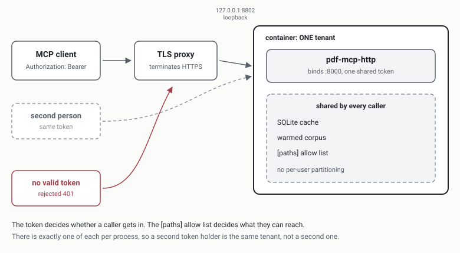

# Remote access over HTTP

`pdf-mcp-http` authenticates with a single shared bearer token, `PDF_MCP_AUTH_TOKEN`, verified by FastMCP's `StaticTokenVerifier`. One token, one tenant, no per-user identity. That is the whole model. This page covers what it protects, what it does not, and how to run it safely.



## What it is

`pdf-mcp-http` runs the same tools as the stdio entry point, served over HTTP at `/mcp` by default. Every request to that endpoint carries an `Authorization: Bearer` header, and the token in it is compared against the one value in `PDF_MCP_AUTH_TOKEN`. Anything else is rejected. One route is deliberately outside auth: `GET /health`, which returns `status` and `version` and nothing else, so an uptime probe can confirm liveness without holding a credential. There are no sessions, no per-user identity, and no scopes; the verifier holds a single `client_id` of `pdf-mcp` and an empty scope list.

## When to use it, and when not

Use it when one person, or one agent acting for one person, needs pdf-mcp over the network: a home server you reach from a laptop, a VPS you own, a container behind your own proxy. The transport exists because process-per-conversation stdio cannot span machines.

Do not use it to serve a team from one endpoint. The reason is structural, not a policy preference. Every caller of a process shares one SQLite cache, one warmed corpus, and one global `[paths]` allow list, and nothing in the request is scoped to the caller because nothing in it identifies the caller. A second person on the same endpoint is not a second tenant; they are the same tenant with a second keyboard.

## Threat model versus stdio

Three differences matter when moving from stdio to HTTP.

1. The boundary becomes a bearer token in a header, only as strong as the client config file that holds it. Stdio inherits the operating system's user boundary instead: if you can spawn the process, you were already that user.
2. The process is long-lived, so a warmed corpus and its cache outlive any single session. Both transports write the same SQLite cache, but `PDFCache.__init__` calls `clear_expired()`, so stdio sweeps the TTL every time a conversation spawns it, while an HTTP process sweeps at startup and may then run for weeks without another.
3. The `[paths]` allow list becomes the only thing standing between a caller and the filesystem. That is why its absence is a startup failure rather than a warning.

For the in-scope and out-of-scope lists that govern security reports, see [`SECURITY.md`](../SECURITY.md).

## The single-tenant contract

Single tenancy here is a contract, not a gap waiting to be filled. Worth stating why, since a reader may arrive from a project that does have per-user tokens.

Issuing a token per user would change nothing about what those users can reach. pdf-mcp has no per-token path scoping, so per-user tokens would authenticate callers while authorizing them identically. That is worse than one honest shared token: a list of named credentials implies an isolation boundary that does not exist, and operators act on what the credential model implies.

Real isolation comes from separate processes with separate cache volumes, exactly as stdio gets it from process-per-conversation. Someone who needs two users runs two containers, each with its own token, cache volume, and allow list. The shipped `docker-compose.yml` is written for one instance: it hardcodes `container_name: pdf-mcp` and declares a single named volume, `pdf-mcp-cache`, and `COMPOSE_PROJECT_NAME` does not override `container_name`. A second instance means changing both, plus the published host port.

## Configuration

Generate the token with `openssl rand -hex 32`. `deploy/bootstrap.sh` does this, writes it into `.env`, and sets that file to mode 600, readable by its owner and root and nobody else. That `chmod` runs only when the script creates the file, and an existing `.env` is left untouched, so after hand-editing the file to rotate the token, re-check the mode: some editors rewrite a file with fresh default permissions. The Compose stack publishes to loopback only, mapping `127.0.0.1:${PDF_MCP_HOST_PORT:-8802}` onto the container's internal port 8000, so nothing is reachable off the box until you put a TLS proxy in front of it. TLS belongs to that proxy, not to the app. See `deploy/Caddyfile.example` for a starting point.

For the environment-variable table, the volume layout, and the Docker mechanics, see [`configuration.md`](configuration.md).

## Client configuration

A client points at the endpoint URL and sends the token as a bearer header on every request. The block below is the Claude-family client config format (Claude Desktop, Claude Code); other MCP clients spell the same two things, the URL and the header, differently:

```json
{
  "mcpServers": {
    "pdf-mcp": {
      "type": "http",
      "url": "https://pdf.example.com/mcp",
      "headers": {
        "Authorization": "Bearer <token>"
      }
    }
  }
}
```

The token then lives in that client's config file in plaintext and inherits exactly that file's protection, no more. Treat it as you would an SSH private key.

## Revoking a token

1. Generate a replacement token: `openssl rand -hex 32`.
2. Rewrite `PDF_MCP_AUTH_TOKEN` in `.env`.
3. Restart the stack: `docker compose up -d --force-recreate`.
4. Update every client that held the old token.
5. Verify the rotation took, by sending the *old* token and expecting a rejection:

```bash
curl -s -o /dev/null -w '%{http_code}\n' \
  -H "Authorization: Bearer <OLD-token>" \
  http://127.0.0.1:8802/mcp
```

Step 3 uses `--force-recreate` on purpose. A plain `up -d` usually recreates the container when a value in `.env` changes, but that depends on how your Compose version hashes the service config, and the failure is silent: the container keeps running with the old token loaded while you believe it is dead.

Step 5 proves it did not. Expect `401`. Any other status, including `200`, means the old credential still validates and the rotation did not take effect, so go back to step 3. Substitute your own port if you changed `PDF_MCP_HOST_PORT` from its 8802 default.

Revocation stops future requests and does nothing about past ones. It does not invalidate anything already read, and the cache retains whatever was extracted while the old token was valid. Treat a leak as disclosure of every PDF reachable under `[paths]`.

## Startup guards

`pdf-mcp-http` fails closed in two places, both before it binds a port.

It refuses to start when `PDF_MCP_AUTH_TOKEN` is unset or empty, telling you to set it to a long random secret. There is no unauthenticated mode to fall back to, by design: an HTTP transport that starts without a credential is an open document server, and the failure would be silent.

It also refuses to start when no non-empty `[paths]` allow list is configured, and the error names the config file it looked in. `PDFConfig.check_path` enforces an allow list only when one is non-empty; deny rules always apply, but deny is subtractive and cannot bound what it was never told to exclude. An absent allow list therefore leaves the server permissive, the correct default for a local stdio install (you already have the filesystem) and unsafe for a remote endpoint. In the Docker image, `deploy/config.docker.toml` supplies that allow list, mounted read-only.

`PDF_MCP_ALLOW_ANY_PATH=1` overrides that second guard, and only that guard. It skips the startup check; it does not touch `check_path` and cannot relax an allow list you have configured, so if your config has one, setting the variable changes nothing. It matters only in the case the guard fires on, no allow list at all, and there its effect is total: the token alone grants read access to every file the process can open. Never set it on a host holding anything you would not hand to the token's holder.
